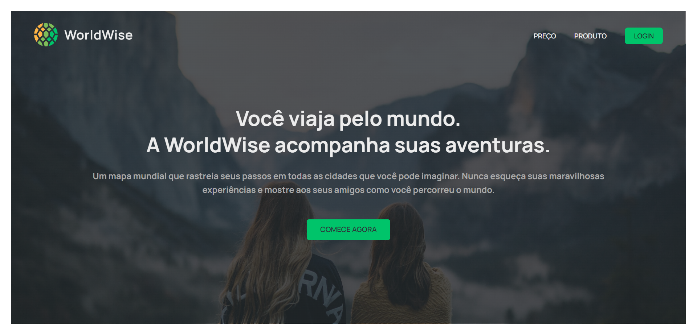
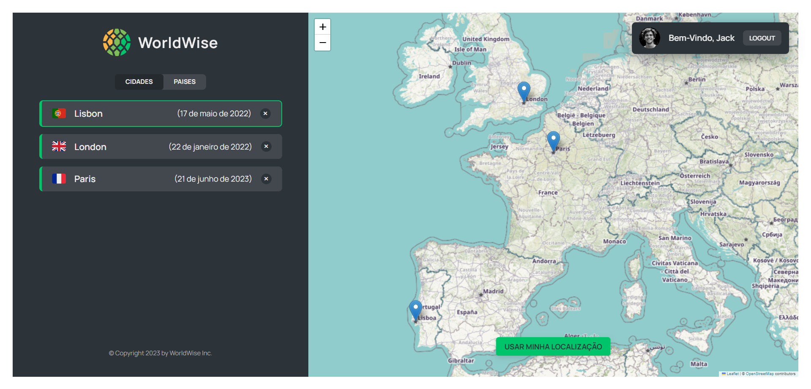

# WoldWise Project

<p>WorldWise é uma aplicação que permite você criar uma lista de cidades e países que você já visitou através de um mapa interativo. </p>
<p>Para criação do mapa foi utilizado a biblioteca Leaflet</p>

<h3>Tela Inicial: </h3>


<h3>Dentro do projeto: </h3>




<h3>Executando o projeto: </h1>

<ul>
  <li><p>Faça o clone do projeto e instale suas dependencias do node</p></li>
  <li>
    <p>Em um 1º terminal execute o seguinte comando para iniciar a aplicação:</p>

  ```
  npm run dev
  ```
  </li>

  <li>
    <p>Em seguida, abra um 2º terminal e execute o comando a seguir para iniciar o json-server:</p>

  ```
  npm run server
  ```
  </li>
</ul>


